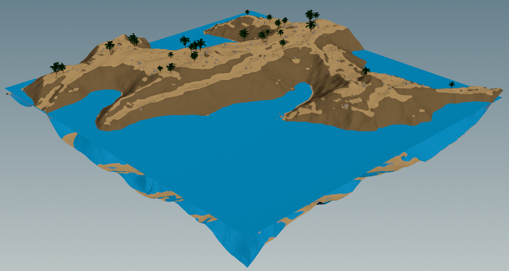
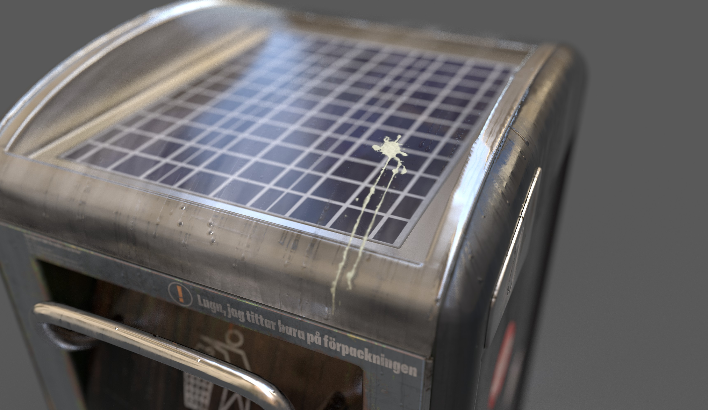
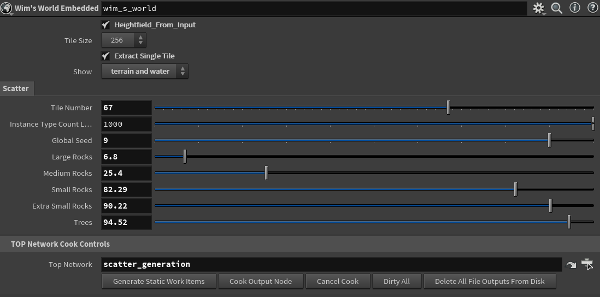
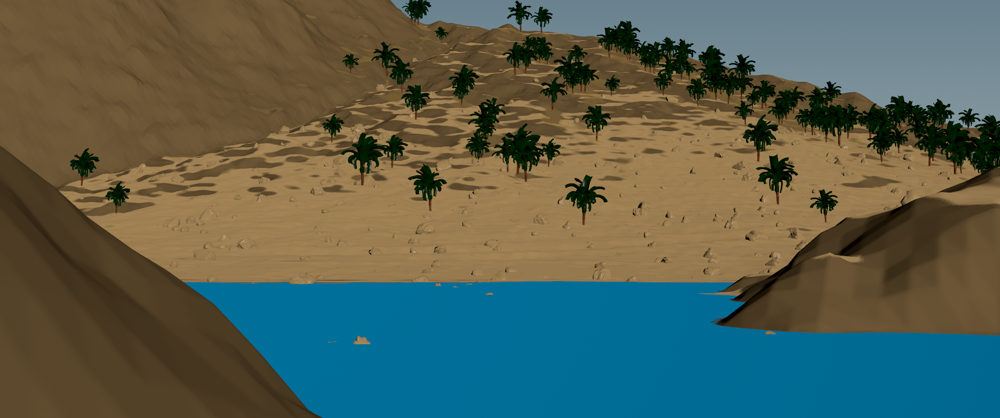

# Wim's World

Welcome to Wim's World, a whimsical workshop where the terrain of creativity meets the sea of technical artistry. This is not just a test; it's an adventure into the heart of imagination powered by Houdini's magic. So, fasten your seatbelts, or rather, grab your wizard hats, as we embark on a journey to sculpt, scatter, and submerge into a world where every pebble is placed with purpose and every stream tells a story.

## Introduction

At Embark, we're not just creating games; we're weaving worlds. This Technical Art Test - Houdini Part is your portal to show us the spells you can cast with your tools and creativity. It's a glimpse into how you tackle challenges, morph landscapes, and breathe life into the digital wilderness.

### Good Luck and Have Fun!

Remember, this journey is as much about the destination as it is about the whimsy along the way. Let your creativity flow as freely as the body of water you're about to create. Show us how you can turn a terrain mesh and object meshes into a coherent, living, breathing ecosystem. Good luck, and let the fun begin!

## Mystical Assets

In the vaults of Wim's World, among the scrolls and potions, lie our enchanted assets. Each asset holds magic ready to be unleashed in your creations.

### 3D Artifacts and Scrolls of Texture

#### The Enchanted Trash Can

Within the arcane archives, you will find the `Enchanted Trash Can`, a model of mystery, accompanied by scrolls of texture hidden in the `tex` folder. This artifact, along with its magical textures, is poised to add a touch of realism to your mystical landscapes.

*Artifact Location:* `assets/trash_can.fbx`

Dive deeper into the `img` folder, and you shall uncover more renders of this curious container, each casting it in a new light and from different angles, showcasing its versatility in the realm of creativity.

## Instructions

Your quest in Wim's World involves a series of enchantments and incantations using Houdini and a supplied FBX. Here's what you need to conjure up:

- Transmute the data type of objects or terrain as needed.
- Scatter and scale objects across the terrain with the grace of a seasoned sorcerer, ensuring everything looks as if it's been there since time immemorial.
- Summon forth a body of water, making sure it blends harmoniously with its surroundings.
- Purify the terrain mesh, removing any anomalies that disrupt the natural flow of the world.
- Mold the terrain to ensure all objects and elements are integrated seamlessly, creating a vista that invites exploration.

Feel empowered to modify data as you see fit, but remember: the goal is to craft a distribution that's not only mesmerizing but also viable for a modern game environment. Keep your incantations within reasonable limits of instances and mesh variations.

## The Conjurer’s Console: Interface Alchemy

Within the mystical bounds of Wim's World, a sorcerer's instruments await - the Conjurer's Console, a panel of powerful alchemy where one weaves the elements into existence. Behold, the `wim_s_world` interface, a cauldron of creation where your will shapes the very fabric of the realm.

### The Arcane Sliders and Switches

- **Tile Size & Terrain Display**: At the helm, the `Tile Size` selection is your gateway to scale the realm's vastness. With a flick of the `Extract Single Tile`, one can isolate a sliver of the world for intimate enchantment, selecting between `terrain and water` views to inspect the interplay of earth and liquid.

- **Scatter Incantations**: Below, the sliders hold sway over the Scatter spell's potency. Adjust the `Tile Number` to summon forth the number of tiles you desire, each awaiting your command. The `Instance Type Count Limit` guards against overwhelming the canvas with too many entities, preserving the balance of the world.

    - **The Elements**:
      - `Large Rocks`: Drag to call forth boulders, the bones of the earth.
      - `Medium Rocks`: Slide to scatter stones, the realm's rugged skin.
      - `Small Rocks`: Maneuver to pepper pebbles, the whispers of the wild.
      - `Extra Small Rocks`: Command the grains, the unsung heroes underfoot.
      - `Trees`: Summon the sentinels of the forest, reaching skywards.

- **Global Seed of Randomness**: The `Global Seed` slider weaves chance into your world, ensuring that no two stones stand alike, no two trees share the same story.

### The TOP Network Cook Controls

Below these mighty sliders lies the engine of it all, the `TOP Network Cook Controls`. Command the `scatter_generation` to commence the concoction of your world. Here, you may:

- **Generate Static Work Items**: To crystallize your intentions into tangible forms.
- **Cook Output Node**: To breathe life into your creations, seeing them flourish in the realm.
- **Cancel Cook**: Should the pot bubble over, halt the alchemy.
- **Dirty All**: To rewind the enchantments, clearing the slate for new spells.
- **Delete All File Outputs From Disk**: When the canvas must be cleansed entirely, wipe it clear, and begin anew with a clean parchment.

In this cauldron of creation, your visions come to life, sculpted by the very essence of Wim’s World. Here, in the Conjurer’s Console, your adventure is but a slider away.

## Easy Installation: Embedded Enchantment: The Main Embedded Hip

In the heart of Wim's World, beneath layers of mystical codes and incantations, lies the `main_embedded.hip` - a core artifact that holds the essence of this whimsical workshop. Crafted with the utmost care by the wizards of Embark, this embedded hip is imbued with all the necessary spells, artifacts, and textures required to navigate and mold the terrain of creativity without seeking aid from external realms.

### Self-Sufficiency and Magic Within

- **No External Dependencies**: The `main_embedded.hip` is a standalone marvel, requiring no allegiance to external data sources or hierarchical digital assets (HDAs). Every necessary component to breathe life into your creation is contained within this powerful hip file.
- **Unleash Creativity Without Bounds**: With everything you need at your fingertips, you're free to sculpt, scatter, and summon with unrestrained imagination. The magic of Wim's World is at your command, without the need to venture beyond for additional spells or charms.

### Harnessing the Power

To wield the power of the `main_embedded.hip`, simply ensure you're operating within the sacred bounds of Wim's World setup. There's no need to import or configure external assets or data; your environment is primed and ready for your creative incantations the moment you step into this realm.

Embrace the magic of the `main_embedded.hip` and let it guide your journey through the terrain of creativity, where every creation is a testament to your mastery over the digital elements.

## Advanced Installation: Setting up the package

Welcome to the enchanting setup process for Wim's World! To ensure a smooth journey into this whimsical realm, follow these magical steps:

### Preparing Your Spellbook (Installation Instructions)

1. **Locate the `Wim-s-World_Package.json` File**:
   - Begin by finding the `Wim-s-World_Package.json` file. It's the key to unlocking the gates to Wim's World in your Houdini environment.

2. **Copy the JSON File to Houdini's Packages Folder**:
   - With the JSON file at hand, navigate to your Houdini packages folder. You'll typically find this mystical place in your Documents folder, under `Houdini`.
   - If by chance you do not see a `packages` folder there, fear not! Simply conjure one into existence by creating a new folder and naming it `packages`.
   - Place the `Wim-s-World_Package.json` file within this newly formed or pre-existing `packages` folder.

### Enchanting the JSON File with Your Local Magic

Before you proceed, there's a small yet crucial enchantment required:

1. **Modify the `WIMSWORLD` Variable**:
   - Open the `Wim-s-World_Package.json` file with a text editor of your choice. Here, you'll find a variable named `WIMSWORLD` that holds the power to link your local realm to Wim's World.
   - You must change the value of `WIMSWORLD` from its current path (`"C:/Github/Wim-s-World"`) to the path where you've decided to store Wim's World
